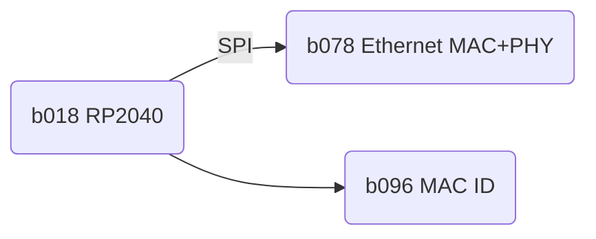

# edgy_board number c001
This design is part of the [edgy board project](https://github.com/skunkforce/edgy_boards).


This design is a composition of edgies.

# getting started
This repository uses submodules. After cloning use the command 

```$ git submodule update --init --recursive```

to pull the submodules before opening the project with kicad. 

# Tests
Tests can be found in [TESTS.md](TESTS.md)

